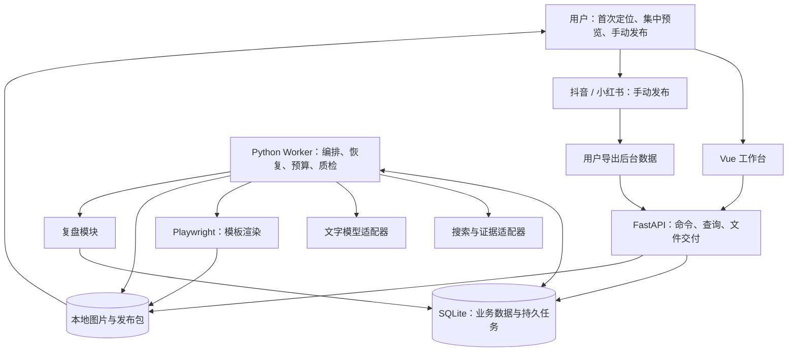

# 项目架构设计

设计 v1.1 · 2026-10-01。适用：单用户、单机、低并发图文工作台。执行澄清见 06；API 配置先实现，默认实际消耗追踪，金额上限可选。下列结构为方案。

## 1. 总体结构

选择模块化单体：一个代码仓库、一套业务模型，API 与长任务执行分进程。模块边界清楚，但不拆成需要独立运维的微服务。



数据流：账号档案 → 批次 → 研究证据 → 选题 → 母稿 → 平台版本 → 渲染图片 → 质检 → 审阅快照 → 发布记录 → 数据快照 → 复盘 → 下一批候选。

## 2. 推荐技术栈

| 层 | 建议选择 | 原因与边界 |
|---|---|---|
| 前端 | Vue 3＋TypeScript＋Vite | 集中预览、版本状态、轻量编辑；组件库只选择一个 |
| API | Python＋FastAPI＋Pydantic | 统一 DTO 校验、任务提交、数据处理；不在 HTTP 请求内等待完整生成 |
| 业务持久化 | SQLAlchemy＋Alembic＋SQLite | 本地单用户启动成本低，迁移受控；初期保留关系型字段与必要 JSON 文档 |
| 长任务 | 独立 Python Worker＋数据库任务表 | 进度、租约、预算及失败可恢复；首版一个执行槽 |
| 图文渲染 | Python Playwright＋Chromium＋版本化 HTML/CSS 模板 | 避免引入第二套 Node 渲染服务；正文排版可修改与测量 |
| 文件存储 | 本地目录＋哈希＋清单 | 图片、来源摘录、导入原件与 ZIP 独立于数据库 |
| 文字 AI | 一个真实 Provider 起步，结构化响应适配 | 模型供应商可替换，不把模型名写入业务规则 |
| 搜索 | 一个真实搜索 Provider＋受控网页读取 | 来源 URL、访问时间、摘录和可访问性独立保存 |
| 运行入口 | Windows 隐藏后台启动脚本，显式启动/停止 | API 与 Worker 有健康状态；初期不安装开机自启服务 |

版本在 P0 锁定并进入依赖锁文件，不在设计阶段指定未经实际验证的“最新版本”。

官方能力依据：[Vue TypeScript](https://vuejs.org/guide/typescript/overview.html)、[Playwright 截图](https://playwright.dev/docs/screenshots)。具体模板、分页与校验属于本项目实现，而非框架自带业务能力。

## 3. 为什么任务要独立运行

生成、重试和渲染可能持续数分钟，用户关掉网页不应丢任务。API 只在一个短事务内写入 run/job，然后返回 202。Worker 执行并写入检查点，前端轮询任务和事件即可；首版不必同时引入 WebSocket/SSE。

FastAPI 的 BackgroundTasks 是响应后执行机制；本项目选择独立持久任务执行，是为了满足恢复、租约、成本对账等要求。不是把 BackgroundTasks 当持久队列。[官方说明](https://fastapi.tiangolo.com/tutorial/background-tasks/)

## 4. 任务可靠性

1. 原子领取：任务状态为 queued，事务内条件更新为 running，设置 lease_owner、lease_expires_at 与递增 fencing_token。
2. 执行：定期续租；网络调用与渲染在事务外进行。默认一个执行槽，避免 SQLite 写竞争与模型调用失控。
3. 产物：先写临时文件并校验，再在同卷原子移动到不可变产物目录，最后短事务登记产物与阶段成功。
4. 提交：必须持有当前 fencing_token；旧执行者晚到的结果不能覆盖新执行者。重复提交由业务唯一键去重。
5. 恢复：进程重启后回收过期租约；根据已完成阶段、内容哈希及远端 request_id 决定复用、查询或重做。
6. 外部不确定结果：请求超时但供应商可能已收费时，标记 outcome_unknown；先查询/对账。供应商不支持查询或幂等时不盲目重发，也不宣称 exactly-once。

SQLite WAL 适合本设计的同机读写，但仍有单写者约束；数据库放本地磁盘，不放网络共享或同步盘。[SQLite WAL 官方说明](https://www.sqlite.org/wal.html)

事务成功而文件不存在、文件写成但未登记等不一致由恢复扫描处理：缺文件重渲染；未登记文件校验后回收登记或隔离。参考 05 中的故障验收。

## 5. AI 与普通程序的边界

AI 负责：提出问题、归纳资料、选题理由、写稿与改写、评论主题和复盘解释。

程序负责：状态转移、权限、审批、金额与次数上限、JSON 校验、引用 ID 有效性、指标计算、布局检测、导出、幂等与审计。AI 不能直接给自己审批、解锁预算或标记已发布。

长任务流程由代码固定 DAG 驱动，生成文本不是可执行脚本。每个步骤输入输出有 schema，模型返回无效字段就走限定次数修复，不让下游猜测解析。

## 6. Skills 的位置

Skills 仅作为经过检查、固定版本的流程说明和提示词材料，放在 prompts/ 或 skills/。来源、版本/哈希、许可及引用文件写入 registry。第三方脚本不因导入 SKILL.md 自动执行。

不把“装 skill”当成搜索、模型计费、平台登录或图片导出的替代品。每种真实能力都必须有可调用适配器及契约测试。

本对话里的 Codex 工具、订阅和已连接应用不会自动成为独立应用的后端。独立运行通过设置页配置文本/搜索接口、凭据与模型；缺配置不阻塞本地 seed 和 fixture 开发。金额上限可选，默认按 API 回传用量和账单追踪。Fixture 模式界面与文件明确标为演示，不能假充真实模型运行。

设置页支持 adapter_type、base_url、model_id、服务端密钥引用、超时、输出上限及连接测试；不同协议由不同 adapter 处理，不能声称任意 URL 都兼容。保存配置不自动调用，用户测试/启动任务时才使用已启用 API。搜索独立配置；没搜索可基于用户提供资料生成，标明未执行自动搜索。

## 7. 图文渲染设计

母稿与布局分离：PlatformDraft.pages[] 只放标题、正文、图示类型、asset_id 和引用。Renderer 把这些数据注入可信模板，拒绝 AI 生成的任意 HTML/JS。

首版两个内容版式：观点/清单型，步骤/对照型。封面是同套设计的组件。每页文字用排版层绘制，真实截图及可选插画独立存放。

采用版式配置中的尺寸与安全区，不在代码里假定永远适用的发布规格。P0 先使用可调整的工程默认值，verified=false；以后实际上传核对再保存 tested_at 和 profile_version，不等待平台登录再开发。等待字体与图片加载后截图；检查文本边界、溢出、空图、对比度和文件完整性。溢出优先精简/拆页，不无限缩小字号。

## 8. 本地运行与数据边界

- 生产模式同源提供前端和 API，默认仅监听 loopback。写接口校验会话与 Origin，开发 CORS 不用通配符。
- Provider 密钥只留服务端环境配置或系统凭据存储；导出包、日志、前端状态与备份不包含密钥。
- 网页只允许 HTTP(S) 公网目标，拦截回环、内网及重定向到内网；禁止网页内容变成工具指令。
- 文件上传限制大小和类型，路径由服务端生成。导入原件可保留，拒绝路径穿越；平台评论只保存必要字段。
- 公共资料和用户选择的内容可以按配置发送给模型；后台数据优先本地计算，传给模型的是必要摘要及去标识评论。
- 默认不托管平台登录态；首版不建自动发布通道。

## 9. 建议目录

```text
content-workbench/
  apps/web/src/{pages,components,api,types}/
  backend/app/{api,domain,services,workflow,providers,rendering,storage}/
  backend/migrations/
  templates/{checklist,walkthrough}/
  prompts/{research,topic,draft,adapt,review}/
  schemas/
  scripts/{start,stop,backup,restore}/
  tests/{unit,integration,e2e,fixtures}/
  docs/
  data/                       # 不入 Git
    app.db
    sources/
    artifacts/
    imports/
    packages/
    backups/
```

这是新项目结构，不在 quote_system 内创建业务模块。当前文档保存在本对话目录，后续建仓时整体迁移。

## 10. 扩展条件

先不引入 Redis、消息中间件、向量数据库或复杂 Agent 框架。当需要多机器 Worker、多人协作，或实际测出写锁/队列吞吐瓶颈，再迁移 PostgreSQL 与成熟任务队列。Provider、Repository 和 ArtifactStore 接口保留迁移边界，但首版只实现一种存储。
