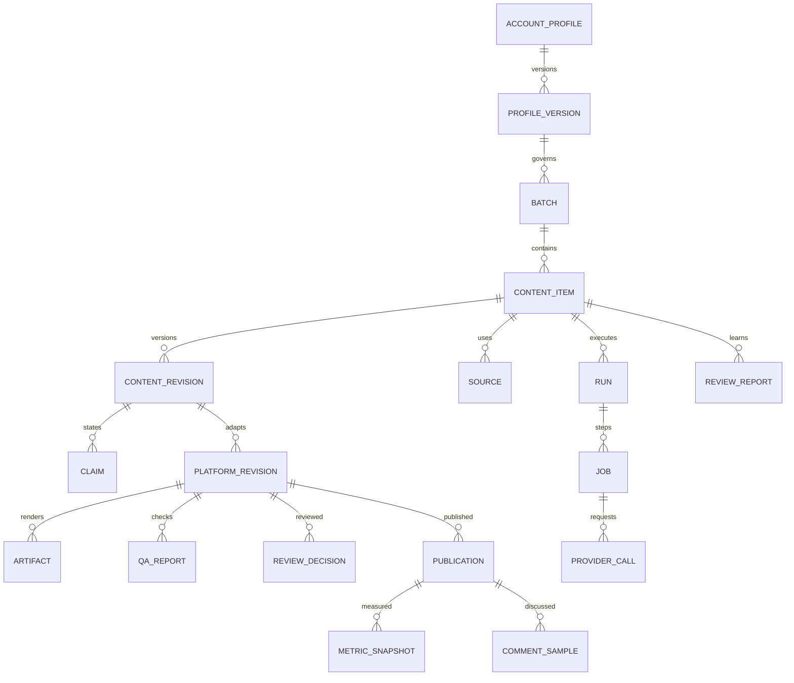

# 数据模型、状态与接口约定

设计 v1.1。这是逻辑模型与 API 草案；落地时生成 OpenAPI、迁移和 JSON Schema。本文件未创建真实数据库。默认实际用量追踪，金额限额可选，详见 06。

## 1. 数据约定

- 主键使用应用生成的 UUID；C001 等为显示编号，不能作为跨项目唯一键。
- 业务时间存 UTC，展示时使用账号时区；保留导入文件原时间文本及解释方式。
- 所有 revision、证据摘录、检查与数据快照追加保存，不直接覆盖历史。
- SQLite 外键每连接启用；金额用整数微货币单位＋币种，禁止浮点累计费用。
- JSON 用于页面列表、规则、候选理由、检查详情；用于查询/约束的关联与状态放正式列。
- 资产路径使用相对存储键，不能接受客户端任意绝对路径。

## 2. 实体与关系



Claim 的 evidence_refs[] 引用 Source 的具体段落、文件页码或实验记录定位。首版可作为经校验 JSON 保存；跨内容复用来源时由 content_source 关联表扩展，不复制失去定位的文本。

## 3. 核心字段与约束

| 实体 | 主要字段 | 必须保证 |
|---|---|---|
| account_profile / profile_version | name、version、audience、pillars、voice、platforms、limits、provider_policy | 历史版本不可变；批次固定引用某版本 |
| batch | profile_version_id、item_limit、cost_mode、reserved_cost、budget_limit（可空）、currency、state | hard_cap 时额度不能被并发预留穿透；usage_tracking 不要求金额字段 |
| content_item | batch_id、display_id、topic、selected_by、selection_reason、state、active_revision | selected_by=ai/user；不能伪造人工选择 |
| source | content_id、url/file_key、retrieved_at、excerpt、locator、sha256、access_state | 缺原文与只有搜索摘要时显式区分 |
| content_revision | content_id、version、parent_id、brief_json、claims_json、input_hash | unique(content_id,version)，母稿与平台稿分离 |
| claim | revision_id、kind、statement、evidence_refs、verification_state | 事实有可解析引用；观点不伪装事实 |
| platform_revision | content_revision_id、platform、version、title、caption、pages_json、profile_version、content_hash | 已渲染 revision 不原地修改；两平台独立状态 |
| artifact | platform_revision_id、kind、page_index、storage_key、sha256、width、height、template_version | 路径有效、文件存在；页序唯一；导出可校验 |
| qa_report | platform_revision_id、artifact_manifest_hash、checks、result、repair_round | 检查绑定 exact revision/文件集合，不能跨版本沿用 |
| review_decision | platform_revision_id、manifest_hash、decision、actor、decided_at、note | actor 仅可信用户会话；通过须对应检查通过的版本 |
| publication | account_id、platform、platform_revision_id、link/post_id、published_at、status | 至少链接或平台作品 ID；手动声明与已核验状态分开 |
| import_batch | file_hash、format、mapping_version、state、error_rows、created_at | 同文件同映射重复请求幂等；重映射建立新版本 |
| metric_snapshot | publication_id、import_id、observed_at、age_hours、raw_fields、metrics、supersedes_id | 同一采集上下文去重；修订追加而非覆盖 |
| comment_sample | publication_id、import_id、anon_id、text、sample_context、category | 去掉不需要的身份信息；保留样本口径 |
| review_report | content_id、snapshot_ids、comment_import_ids、facts、hypotheses、next_topics | 输入快照可追溯；无数据不能生成效果结论 |
| run / job | content_id、stage、state、input_hash、output_refs、attempt、lease、fencing_token、not_before | unique(run_id,stage,input_hash)；合法状态变化 |
| provider_config | name、adapter_type、base_url、secret_ref、model_id、timeout、max_output_tokens、enabled、capabilities、test_status | 密钥不回显；支持未配置状态，费用单价不是必填 |
| provider_call | job_id、request_key、remote_request_id、provider/model、prompt_version、usage_raw、pricing_version、estimated_cost、reported_cost、reconciled_cost、currency、billing_state、state | 用量与费用分开；未知不记零；估算不能覆盖实际账单 |
| event / exception | entity_id、type、actor、payload、time、resolved_by | 操作追加记录；同原因聚合异常 |

Provider 配置仅引用密钥标识；明文密钥不写上述表。schema_version、created_at 等通用字段在实现时统一加入。

## 4. 结构化稿件契约

以下是示例 DTO，不代表真实后台数据或已经完成的产物。

```json
{
  "schema_version": "1",
  "content_revision_id": "<uuid>",
  "platform": "xiaohongshu",
  "title": "AI 帮我做自媒体，我还要干什么？",
  "caption": "第一轮先做图文，记录实际需要人工参与的部分。",
  "pages": [
    {
      "index": 1,
      "layout": "cover",
      "heading": "AI 做自媒体，人还要做什么？",
      "body": ["进行中的真实尝试"],
      "claim_ids": [],
      "asset_ids": []
    }
  ],
  "limitations": ["尚未取得发布后的数据"],
  "platform_profile_version": "pilot-1"
}
```

Pydantic/Schema 校验 page index 连续、layout 来自枚举、asset/claim 引用有效。模型不得返回 HTML、文件路径、shell 命令或 approval 字段；多余字段拒收。页数/长度限制来自版本化 profile，而不是模型自行决定的“平台规定”。

## 5. 状态与转换

内容主状态：candidate → selected → researching → drafting → rendering → checking → ready_for_review → approved → partially_published/published → awaiting_data → reviewed。

平台变体也有 rendering/checking/ready_for_review/approved/exported/published 状态。主状态由两个变体与任务状态聚合；单平台失败不能把整体标完成。用户可以显式撤销某平台本轮制作，记录理由，不静默跳过。

任何自动阶段可以出现 blocked、failed、paused、canceled，保存 blocked_stage；恢复回对应步骤。没有数据时 awaiting_data 是正常等待，不自动复跑研究任务。数据导入后运行复盘；新增快照产生新复盘版本。

任务状态：queued → running → succeeded；临时故障 → retry_wait → queued；需要用户/对账 → blocked；终止 → failed/canceled。任务恢复只用记录的转换，不由模型写 state。

| 触发 | 允许转换 | 事务或校验 |
|---|---|---|
| 自动检查通过 | checking → ready_for_review | manifest hash 与检查输入一致 |
| 用户批准 | ready_for_review → approved | expected_revision/manifest 都匹配；否则 409 |
| 一句话修改 | 创建新 revision，进入相应制作阶段 | 原版本与批准保留，新版本无批准 |
| 下载 ZIP | approved → exported（变体） | 验证批准对象、文件与 ZIP 清单一致 |
| 用户登记发布 | approved/exported → published | 有具体平台记录；文件下载不触发 |
| 撤回批准 | approved → ready_for_review | 已发布的历史记录不能因此抹除 |

## 6. API 草案

基础路径 /api/v1；长任务返回 202＋run_id；分页查询有 cursor。命令支持 Idempotency-Key，业务参数哈希不同但 key 相同返回 409。状态冲突 409、输入错误 422、预算不足采用 409＋BUDGET_LIMIT 错误码。

| 接口 | 用途 |
|---|---|
| POST /profiles，POST /profiles/{id}/versions | 新建定位及版本 |
| GET/POST /provider-configs，PATCH /provider-configs/{id} | 列表/保存文本或搜索配置；响应只有密钥掩码与是否已设置 |
| POST /provider-configs/{id}/test | 用户主动发起一次有明确范围的连接测试，记录可能产生的 usage |
| GET /usage | 按任务/日期/模型查询实际用量与分币种费用，未知与估算分别展示 |
| POST /batches | 以 profile_version、条数、限额创建批次 |
| POST /batches/{id}/runs | 启动自动生产，mode=real/fixture |
| GET /runs/{id}，GET /runs/{id}/events | 状态、产物、异常与成本 |
| POST /runs/{id}/pause，/resume，/cancel | 用户控制执行；resume 不自动扩大预算 |
| GET /contents，GET /contents/{id} | 内容列表、版本与平台预览 |
| POST /contents/{id}/change-requests | 用户一句话修改，带 base_revision_id |
| POST /review-decisions | 对一组具体平台 revision 做决定；服务端记录用户身份 |
| POST /packages | 为指定已批准 revision 创建发布包，返回异步任务 |
| GET /packages/{id}/download | 下载已完成 ZIP |
| POST /publications | 人工登记发布记录与对应 revision |
| POST /imports，GET /imports/{id} | 上传数据，返回解析结果与待映射项 |
| POST /imports/{id}/mapping | 仅首次映射或未知字段时提交；已知映射自动执行 |
| POST /contents/{id}/reviews | 对明确快照生成复盘 |
| GET /exceptions，POST /exceptions/{id}/resolve | 集中查看与解决必要异常 |
| GET /health | API/Worker/存储可用性；不返回凭据 |

不存在 POST /auto-publish。Provider 请求不由前端直接发出。

批准命令示例：

```json
{
  "decision": "approve",
  "targets": [
    {"platform_revision_id": "<uuid>", "expected_manifest_hash": "<sha256>"}
  ]
}
```

原子校验该组目标；任何一个已变更则整组返回冲突，前端刷新预览。用户可重新只批准未变动的平台版本。服务端不得接受客户端传入 actor=system 作为人工批准。

## 7. 发布包与数据导入契约

ZIP 结构：platform/content-id/revision/{images/page-01.png,...,caption.txt,manifest.json}；source-notes.md 单独放在资料目录，不混入准备上传的图片列表。

manifest 包括内容/平台/revision ID、批准记录、文件哈希、模板与 profile 版本。资料包可包含编辑源稿；发布包只放用户上传所需项及核对清单，不含密钥、私密源文档或内部日志。

标准长表指标模板字段：platform、post_id 或 url、published_at、observed_at、metric_name、value、unit、denominator_metric、traffic_type。raw_metric_name 保留映射前名称；窗口值与累计值另存 aggregation_kind，不能互相比较。

评论模板字段：platform、post_id/url、anonymous_comment_id、text、observed_at、sampling_method。公开用户名不为分析目的强制收集。

## 8. 必须始终成立的不变量

1. 没有批准记录，不能产出标为 ready-to-publish 的包；过期批准不能覆盖新图/新文案。
2. 没有实际发布登记，不能通过下载、定时器或 AI 推断自动标记已发布。
3. 重试不会重复追加同一阶段产物；失败不会抹掉前面成功阶段。
4. Provider 结果未知不等于免费失败，租约过期也不允许盲目重复计费请求。
5. 真数据、fixture 和估算显式区分；缺失值不变成 0。
6. 模型无法直接更改批准、预算上限、身份、连接权限和发布状态。
7. 复盘按固定输入快照生成，后续新增数据不会暗中改变旧结论。
8. 金额上限为 null 不阻塞 usage_tracking；不得把 null 当作 0，亦不得因此解除任务次数与批次范围限制。
9. 保存 API 设置不自动调用；缺少搜索配置时不能将模型生成文本伪称实时搜索结果。
