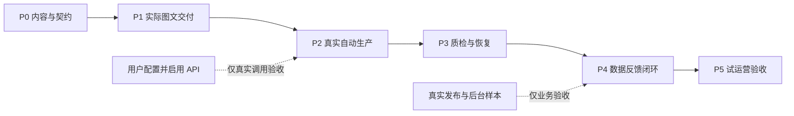

# 项目开发规划与任务清单

规划 v1.1 · 2026-10-01。任务状态由执行方按实际成果更新，本文不声称已开发应用。[执行澄清](06-execution-clarifications.md)明确：C001 由开发方整理；API 使用时配置；金额限额可选；外部访问/样本不阻塞独立工程开发。

## 1. 交付顺序

先用 C001 实际制作一题双平台图文，确认产物能发布；随后逐步接通完整自动闭环。每个阶段交付可演示结果，不先搭空壳大平台。

工期假设：1 名熟悉 Python/Web 的开发者，AI 辅助；已有可用电脑、及时提供测试账户/接口条件；不含素材外拍、平台审核等待及模型账单限制。下面为净开发工作日区间，需在 P1 结束后重新估算，不是承诺。

| 阶段 | 净工作日估计 | 可交付结果 | 开始条件 / 退出标准 |
|---|---:|---|---|
| P0 工程契约 | 1–2 | 开发方整理 seed、默认可调规格、API 设置及导入契约 | 无需用户先交制作包、账号、密钥或预算数字 |
| P1 图文交付骨架 | 3–4 | 本地打开页面 → C001 双平台图文 → 预览 → 下载 ZIP | 本地工程验证通过；实际上传另列待集成，不阻塞 P2 |
| P2 自动内容生产 | 4–6 | 研究/选题/文案流水线及真实 Provider 适配 | fixture 可验证工程；配置 API 后补真实调用验收 |
| P3 低干预与恢复 | 3–5 | 自动修复、集中异常、用量追踪、可选限额、恢复 | 不依赖真实账号即可故障模拟；真实费用之后对账 |
| P4 数据反馈闭环 | 4–6 | 标准导入、复盘、下一轮候选/制作 | fixture 完成工程验证；真实样本到位后补平台映射及业务验收 |
| P5 试运营与交付 | 3–5 | 安装启动、备份恢复、连续内容试跑、验收报告 | 前面各阶段过线；真实人工负担和费用可查 |

合计约 18–28 个净开发工作日，约 4–6 周量级；首次可用图文交付目标在 P0＋P1，即 4–6 个工作日。首次发布后的 24h/72h/7d 观察是额外日历等待，可与开发交叠，不能用模拟数据跳过。

完整 v1 应以 P5 验收为完成；P1 可称“图文制作原型”，P2 可称“生产自动化原型”，不能提前称已验证完整增长闭环。

## 2. 可直接领取的任务

每项任务至少提交对应代码/配置、可演示产物、必要验证记录；执行方按实际完成附 commit/运行记录。工程完成与外部集成验收分别标记，不因缺少上线条件停止全部开发。

### P0：由开发方完成工程输入

- [ ] T01 内容基线：直接采用 ../seeds/C001/seed.json 与 source-notes.md，结合现有文案整理结构化输入并验证。文件若未随文档复制，由开发方按 C001 文案重建；没有证据的事实删除或标注，不向用户索取已制作成品。
- [ ] T02 发布规格配置：实现可编辑的尺寸、页数、格式、文字限制，工程默认标 verified=false。缺实际账号时记录待上传验证，继续排版和导出开发；实际界面核对作为独立集成项。
- [ ] T03 API 与消耗契约：设计设置页、文本/搜索适配器、未配置状态、连接测试、usage/费用追踪与 fixture；金额上限可选。真实端点、密钥及模型由用户使用时填写，后台样本以后补，不作为 P0 工程前置条件。

P0 工程门槛：开发方整理好 seed、配置契约和默认规格即可继续 P1。真实平台上传、API 调用和后台样本分别进入待集成清单；只有对应的真实业务验收等待它们，其余工程继续。

### P1：先让用户拿到成品

- [ ] T04 独立项目骨架：Vue/TS、FastAPI、配置、迁移、健康检查与隐藏启动/停止脚本。依赖 T01。
- [ ] T05 最小版本模型与任务骨架：profile、content/revision、artifact、run/job、review、events；一个 Worker，任务进度可见。依赖 T04。
- [ ] T06 结构化稿件到图片：两套模板、本地字体、页序/布局检测、截图导出；C001 双平台成品。依赖 T01、T04；正式规格引用 T02。
- [ ] T07 集中预览到发布包：真实图片预览、正文、通过/修改/暂缓、版本绑定、ZIP manifest。依赖 T05、T06；用户手动发布与 T02 上传核对另列待集成，不阻塞此功能开发。

工程演示：浏览器中看到实际页图，下载 ZIP 校验文件。真实上传证明平台兼容性，未验证则明确标记，不阻塞 P2/P3 开发。

### P2：接通 AI，而不是展示固定样稿

- [ ] T08 Provider 接口：API 设置页、真实/fixture 分离、结构化校验、请求编号、原始 usage、已知/未知/估算费用；支持按需配置后连接测试。依赖 T03、T05，开发不要求先填密钥。
- [ ] T09 研究与证据：搜索/读取、source/claim、摘录定位、访问失败降级。依赖 T08。
- [ ] T10 自动选题与母稿：规则筛选、候选去重、自动选择理由、定位版本；禁止捏造亲测。依赖 T09。
- [ ] T11 双平台改写到渲染：两种分页方案与标题/正文、引用链、渲染连接、局部改稿。依赖 T06、T10。

演示：新方向或新资料产生新内容；记录真实调用而非固定返回。未经人工逐节点确认到达集中预览。

### P3：减少用户被打断，并能恢复

- [ ] T12 质量规则：事实引用、数字、模板边界、缺图/字体、重复表达；局部修复最多两轮。依赖 T11。
- [ ] T13 任务恢复：租约、fencing token、幂等、文件/DB 不一致回收、远端结果未知的处理。依赖 T05、T08。
- [ ] T14 消耗与运行限制：默认追踪实际 usage/费用，金额限额可选；保留库存、取消/暂停、重试与总调用次数上限。启用硬限额时实现预留与计价校验；未设置预算时不单因无单价阻断用户启动的有限任务。依赖 T08、T13。
- [ ] T15 一次集中处理：异常聚合、阶段日志折叠、重大变更展示、人工打断和审核时间记录。依赖 T07、T12、T14。

演示：主动终止 Worker 后重启继续；注入溢出、网络失败和预算不足，系统能恢复/停止在正确边界，不把所有异常都交给人。

### P4：拿真实数据闭环

- [ ] T16 发布记录：批准版本、平台链接/ID、发布时间、验证来源；两平台独立记录。依赖 T07。
- [ ] T17 数据导入：先实现标准模板、字段映射、去重、时间与单位校验、缺失项/待匹配，使用标为 fixture 的样本。依赖 T16；实际平台映射与真实数据验收等待样本，不阻塞标准导入开发。
- [ ] T18 评论导入：最少字段、去标识、取样说明、主题归类与原文例证。依赖 T17。
- [ ] T19 复盘：程序指标计算、观察/解释/实验分栏、同口径比较、不足数据降级。依赖 T17、T18。
- [ ] T20 反馈下一轮：复盘版本关联选题、范围内自动采用小改动、库存/预算限制、变更可回退。依赖 T10、T14、T19。

演示：一条真实发布的作品和实际快照，生成可追溯复盘及下一轮候选。没有真实后台数据时本阶段业务验收保持未完成。

### P5：交给人日常用

- [ ] T21 启动与恢复交付：依赖检查、迁移失败提示、后台进程健康、备份/恢复演练，操作说明。依赖 T13、T17。
- [ ] T22 端到端与边界测试：按 05 全部关键场景验收，特别是批准错版、重复付费和导入误绑定。依赖 T15、T20、T21。
- [ ] T23 连续试跑：建议 6 个内容包，真实记录产物、人工分钟、异常、费用、发布情况；数量是工程试跑样本，不代表市场结论。依赖 T22。
- [ ] T24 发布 v1：完成验收报告、已知限制、回退方法、源代码与可安装/启动包。依赖 T23；缺少实测结果不得把设计目标填成已达到。

## 3. 依赖关系

可以独立开展模板与导入样本研究；这不表示当前已经启动并行 Agent。真正的关键路径是成品可交付 → 真实生成 → 稳定恢复 → 真实数据复盘。

## 4. 首周安排建议

| 工作日 | 目标 |
|---|---|
| 第 1 天 | 开发方整理 C001 seed；设置可调工程规格；确定 API 配置和导入契约 |
| 第 2 天 | 建独立仓库、数据契约、启动骨架；尝试第一套模板渲染 |
| 第 3 天 | 两平台页面结构、页图与基础布局检查 |
| 第 4 天 | 一次预览、版本批准和 ZIP 导出贯通 |
| 第 5–6 天 | 完成预览/ZIP 与用量页面；继续 Provider 适配，具备条件时补实际上传及接口验证 |

具体速度以工程完成门槛为准。外部条件缺失时保持相应业务验收为待集成，继续其他模块，不将其伪记为通过。

## 5. 缩减范围顺序

工期不足时依次延期：生成插画、多余模板、截图 OCR、额外平台原生导入、定时运行、复杂看板。仍保留双平台图文、持久任务、版本批准、导出、预算记录、标准数据导入和基本复盘。

只做 v0 时可以先不接搜索/模型，但必须把固定 seed 模式说明清楚。不能把 mock 图表当作已实现数据闭环。

## 6. 决策与风险登记

| 风险 | 处理方式 | 影响的完成门槛 |
|---|---|---|
| 尚未配置搜索/模型 | 先完成配置页与 fixture/故障测试，真实验收等待用户配置 | P2 的真实调用验收 |
| 平台导出拿不到或格式变化 | 标准模板先行，映射版本化；不假设后台 API 权限 | P4 |
| 自动生成质量低、修改多 | 优先减少题材复杂度，改母稿/模板和证据要求，统计修改原因 | P3/P5 |
| 费用不确定、请求超时 | 默认追踪 usage，未知金额不伪造；结果未知先对账；有限重试，硬预算可选 | P3 |
| 人工预览仍很久 | 测量实际耗时；减少每批条数、冗余页数和异常噪声 | P5 |
| 本地程序被关或电脑休眠 | 持久检查点；恢复后继续，不宣称关机仍运行 | P3/P5 |

Provider 由设置页配置；金额上限可留空，不再作为开工条件。执行方只在独立工作确实无法继续时请求最小输入，不要求用户先准备全部生产资料。
